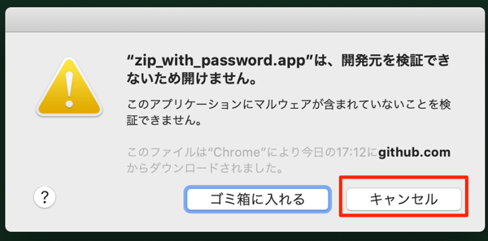
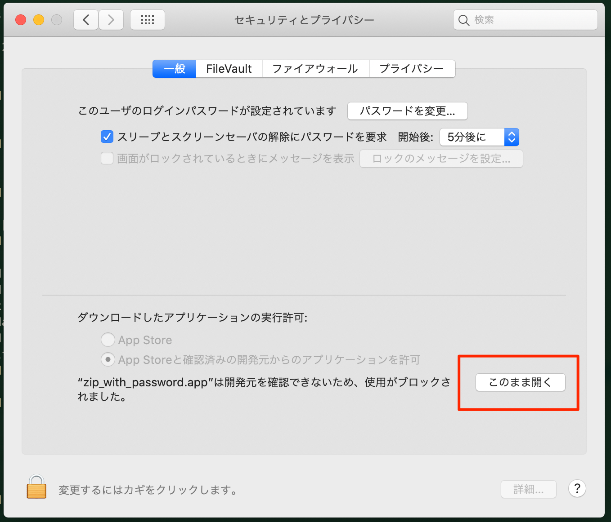
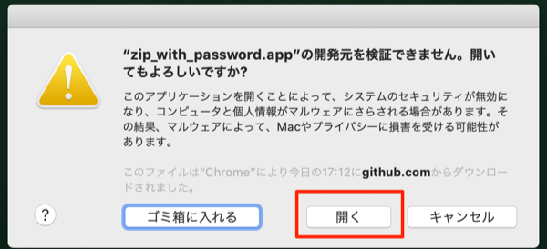

# zip_with_password.app

* パスワード付きのzipファイルを作成するドロップレット（パスワード無しでもOK）
* パスワードは、半角英数字、アンダーバー、ハイフン
* .DS_Store等抜きでアーカイブ
* アーカイブのファイル名は、`archive.zip`


## サービス（右クリックメニュー）への追加

0. appファイル作成し、Applicationsフォルダに移動しとく

```
$ make
$ mv zip_with_password.app  /Applications/
```


1. Automator.appを開く
2. 新規作成のダイアログが表示されたら、サービスを選択
3. 左ペインで、`ファイルとフォルダ > Finder項目を開く` を選択し、右ペインにドラッグ&ドロップ。
4. 右ペイン上部の`サービス`は、次の選択項目を受け取るに`ファイルまたはフォルダ`を選択。
5. 検索対象は`Finder.app`を選択。
6. このアプリケーションで開くに`/Applications/zip_with_password.app`を選択。

7. `command + s` で、適当な名前（例：Zip with password）で保存。


## 最近の Gatekeeper 対応

リリースページから zip ファイルをダウンロードした場合、Gatekeeper に引っかかるので対応

### ダウンロード時

zip_with_password.zip ダウンロード時に以下のエラーの場合は、赤枠内をクリックして、「継続」をクリック。


### 初回起動時

アプリを起動しようとすると「開発元を検証できないため開けません」エラーが発生。


このアラートが出たら「キャンセル」をクリックし、「システム環境設定」の「セキュリティとプライバシー」を開く。<br>
すると、画面下部に「このまま開く」というボタンが出ているので、これをクリック。



再度、アプリを起動すると「開いてもよろしいですか？」という画面が出るので「開く」をクリック。


