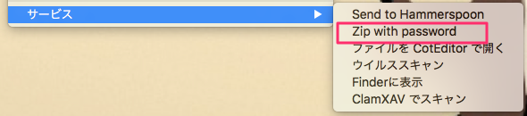

# zip_with_password.app

* パスワード付きのzipファイルを作成するドロップレット（パスワード無しでもOK）
* パスワードは、半角英数字、アンダーバー、ハイフン
* .DS_Store等抜きでアーカイブ


## 右クリックメニューの追加



1. Automator.appを開く
2. 新規作成のダイアログが表示されたら、サービスを選択
3. 左ペインで、`ファイルとフォルダ > Finder項目を開く` を選択し、右ペインにドラッグ&ドロップ。
4. 右ペイン上部の`サービス`は、次の選択項目を受け取るに`ファイルまたはフォルダ`を選択。
5. 検索対象は`Finder.app`を選択。
6. このアプリケーションで開くに`zip_with_password.app`を選択。
7. `command + s` で、適当な名前（例：Zip with password）で保存。


## appファイル作成

```
$ make
```
